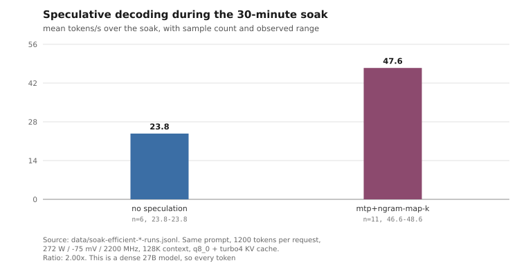
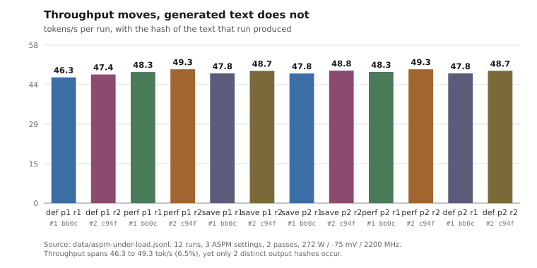

# Tuning Qwen3.8-27B on a Radeon RX 7900 XTX

A measurement log from tuning a single 24 GB RDNA3 card for local LLM
inference: power cap, undervolt, clock limit, speculative decoding, KV cache
types, context length. Raw per-request data, the scripts that produced it, and
an English write-up of what each number does and does not support.

Hardware and build pins are in [docs/setup.md](docs/setup.md). Everything here
comes from one machine.

## What is worth reading here

| | |
|---|---|
| [A gate that detects a bad undervolt by what the model *says*](docs/output-stability.md) | The usual check is "it didn't crash and tok/s held". Ours failed silently at -150 mV, so that check would have passed it. |
| [2.00x from speculative decoding on a dense model](docs/speculative-decoding.md) | And why a published null result on a mixture-of-experts model of similar size is also correct. |
| [`ngram-map-k` is invisible to single-shot benchmarks](docs/speculative-decoding.md#the-n-gram-component-only-pays-off-across-turns) | Neutral on one request, -21% wall time across a ten-turn session. |
| [A 128K window is not equally usable for every task](docs/context-and-quality.md#the-window-is-not-usable-to-the-same-degree-for-every-task) | Same facts, more filler: at 120K key retrieval held at 14/16 while counting scattered entries reached 0/16, by undercounting in every one of these reasoning-off runs. Asked to list those entries instead, the model names the complete set two thirds of the time and still miscounts them, so this is mostly bad arithmetic over what it can see. A needle pass measures the part that survives. |
| [Turning reasoning on erased every one of those errors, and there are two ways to make it cheaper](docs/context-and-quality.md#reasoning-on-the-errors-above-do-not-appear-at-all) | 64/64 against 19/64 on the same 120K material, at 17.3x the median latency and ~2500 reasoning tokens per counting answer. Effort `low` and a reasoning budget of 512 both hold the score for a third to a fifth of the tokens, and they are [not the same kind of lever](docs/context-and-quality.md#two-levers-one-soft-and-one-hard): the effort level is an instruction in the prompt that the model declined in 6 of 32 counting queries and that invalidates the whole prompt cache, while the budget is a hard cap the server closes itself. |
| [Neither KV cache type is deterministic, and one is markedly less so](docs/context-and-quality.md#neither-cache-type-is-deterministic) | Same prompt, same seed, greedy: the next-token distribution moves by up to 0.0017 with `q8_0` and 0.0144 with `turbo4`. Output-hash gates are only as sensitive as the decoded text. |
| [Energy per token misleads when the setting changes the token count](docs/power-and-undervolt.md#energy-per-token-is-the-wrong-metric-when-the-setting-changes-the-token-count) | The setting with the best J/token cost up to 4.8x more energy per answer. |
| [`GGML_VK_DISABLE_MMVQ=0` disables MMVQ](docs/rejected-settings.md#ggml_vk_disable_mmvq-responds-to-presence-not-value) | It is read with `getenv` and branches on presence. Cost us 9.1% of decode. |

## What is not new here

Worth saying up front, because the headline numbers are not the contribution.

Roughly 2x from speculative decoding on a dense model is consistent with what
others have published. That undervolting this card improves efficiency at a
small throughput cost is widely reported anecdotally, and our figures line up
with those reports. Neither is presented as a discovery.

The part we could not find an existing writeup of, and went looking for, is a
check that an undervolt did not quietly change inference output. The advice we
found treats "no crash, same tok/s" as sufficient. On this card an offset past
-100 mV silently stopped taking effect without crashing anything, so that check
would have reported success. What we built instead, and what it does and does
not establish, is [docs/output-stability.md](docs/output-stability.md).

## Headline numbers

Speculation and stability figures come from a 30-minute soak at
272 W / -75 mV / 2200 MHz, 128K context, 1200 tokens per request. The power
figures come from the cap and clock sweeps, two runs per setting, on identical
generated text. Every row names its file in `data/manifest.csv`.

| | |
|---|---:|
| decode, no speculation | 23.8 tok/s |
| decode, `draft-mtp,ngram-map-k` | 47.6 tok/s |
| board power vs stock 303 W | -9.9% |
| energy per token vs stock | -7.9% (-13.9% with the clock cap) |
| throughput cost of the cap | -2.2% |
| junction max over 30 minutes | 86 C |
| perplexity before / after soak | 5.9335 / 5.9335 |





## Configuration we settled on

GPU, applied at boot by `scripts/amdgpu-profile.sh` with read-back verification
and rollback:

```
power cap  272 W     (factory 303 W; never raised)
undervolt  -75 mV
max SCLK   2200 MHz
ASPM       default
```

Server:

```
--ctx-size 131072 --n-gpu-layers 99
--cache-type-k q8_0 --cache-type-v turbo4
--cache-type-k-draft q8_0 --cache-type-v-draft turbo4
--ubatch-size 1024 --batch-size 4096 --parallel 1 --threads 10
--temp 0.6 --top-p 0.95 --top-k 20 --min-p 0.05
--spec-type draft-mtp,ngram-map-k
--spec-draft-n-max 3 --spec-draft-p-min 0.60
--reasoning on --reasoning-effort medium
--reasoning-budget 8192 --reasoning-format deepseek
--mmproj mmproj-Q8_0.gguf --image-min-tokens 1024
```

Set `RADV_PERFTEST=nogttspill`. Do not set `GGML_VK_DISABLE_MMVQ` at all, not
even to `0`.

`turbo4` and `ngram-map-k` exist only in the fork this was built from;
[docs/setup.md](docs/setup.md#which-results-depend-on-the-fork) separates the
fork-dependent results from the ones that do not depend on the fork.

## Limitations

- One card, one machine, one model. Nothing here addresses silicon variation.
- Several results depend on a `llama.cpp` fork and cannot be reproduced upstream.
- The quality gate scored 24/24 in every condition. That is a ceiling, not a
  win, and is [reported as such](docs/context-and-quality.md#the-quality-gate-hit-its-ceiling).
- Sample sizes are small and stated per file in `data/manifest.csv`.
- Our first repeatability gate was wrong. The
  [corrected one](docs/output-stability.md#why-position-by-position-and-not-run-against-run)
  is what produced the results above.

## Layout

```
docs/     the write-up, one file per topic
data/     raw per-request records, one file per experiment
          manifest.csv maps every file to the experiment, the GPU profile in
          effect, the producing script, its record count and its SHA-256
prompts/  the fixed prompts and replayed session the benchmarks use
scripts/  the benchmark harness and the GPU profile script
charts/   SVG charts and make_charts.py, which regenerates them from data/
```

Every figure quoted in `docs/` names the file it came from. If one does not,
that is a bug worth reporting.

Start with [docs/setup.md](docs/setup.md), then
[docs/methodology.md](docs/methodology.md) if you intend to trust a number, then
whichever result file you came for.

`scripts/check.sh` re-validates the data files, rebuilds the manifest and the
charts, and fails if anything committed is stale.

## Reusing this

Scripts and code under `scripts/` and `charts/` are MIT; see [LICENSE](LICENSE).
Measurements under `data/` are CC BY 4.0; see
[data/LICENSE](data/LICENSE). The scripts are commented in Polish; `docs/` is
the English account of what they do.

Everything here remains one machine's measurements. If you reproduce any of it
on another card, an issue is welcome; [CONTRIBUTING.md](CONTRIBUTING.md) says
what makes such a report readable.
