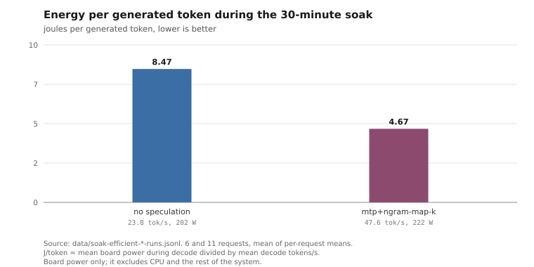

# Power cap, undervolt and clock limit

Nothing here overclocks. The power cap only ever moves downward from the
factory 303 W, memory clock is untouched, and the voltage offset is negative.

## The power cap

`data/power-cap-sweep.jsonl`, two runs per setting, identical prompt and
generated text, so joules per token is a valid comparison here:

| cap | tok/s | board W | J/token | junction max |
|---|---:|---:|---:|---:|
| 303 W (stock) | 59.54 | 301.8 | 5.069 | 89 C |
| 288 W | 59.00 | 287.4 | 4.871 | 84 C |
| 272 W | 58.22 | 271.8 | 4.668 | 81 C |

272 W against stock: 2.2 percent less throughput, 9.9 percent less board power,
7.9 percent less energy per token, 8 C cooler.

272 W is the floor the vBIOS accepts on this card, not a value we picked.

## The clock cap

`data/clock-cap-sweep.jsonl`, all at the 272 W cap, two runs per setting:

| max SCLK | tok/s | board W | J/token |
|---|---:|---:|---:|
| 3045 (uncapped) | 58.25 | 271.8 | 4.666 |
| 2400 | 58.01 | 266.6 | 4.596 |
| 2200 | 56.47 | 246.4 | 4.364 |
| 2000 | 54.08 | 223.6 | 4.134 |
| 1800 | 51.14 | 211.4 | 4.133 |

Efficiency stops improving below 2000 MHz: 1800 buys nothing over 2000 in
J/token and costs a further 5 percent of throughput. We took 2200 rather than
2000 to keep more speed, accepting slightly worse efficiency.

Cap and clock together, against stock: **13.9 percent less energy per token for
5.2 percent less throughput** (5.069 to 4.364 J/token, 59.54 to 56.47 tok/s).
Neither sweep includes the undervolt.

## Where the efficiency comes from

The card sits at its power limit continuously under decode load, so the limit,
not the clock target, decides the operating point. Lowering it moves the whole
voltage-frequency curve down. The clock cap then removes the top of the curve,
where the last few percent of speed costs disproportionate power.

## The undervolt stops taking effect long before the driver says so

Without a clock cap, the offset behaves as expected.
`data/undervolt-sweep.jsonl`, at the 272 W cap, two runs each:

| offset | tok/s |
|---|---:|
| 0 mV | 58.29 |
| -25 mV | 58.84 |
| -50 mV | 59.40 |
| -75 mV | 59.85 |
| -100 mV | 60.24 |
| -125 mV | 60.56 |

With a 2200 MHz clock cap in place it stops.
`data/undervolt-sweep-capped.jsonl`, same two-run structure:

| offset | tok/s | board W |
|---|---:|---:|
| -100 mV | 57.27 | 235.3 |
| -125 mV | 57.31 | 235.9 |
| -150 mV | 57.30 | 236.3 |
| -175 mV | 57.29 | 236.0 |
| -200 mV | 57.31 | 235.7 |

Requesting an extra 100 mV of undervolt changes nothing measurable. The driver
accepts the write and `pp_od_clk_voltage` reports the value back.

`data/undervolt-clamp-vddgfx.tsv` shows what the card actually did. At the
2200 MHz cap, -75 mV produced 715.6 mV average VDDGFX and -200 mV produced
704.8 mV: 10.8 mV of movement for a 125 mV request, at equal power and
identical perplexity. At 3045 MHz the same -75 mV request produced 792.1 mV, so
the clock cap is what pins the voltage, not the offset.

This is why `scripts/amdgpu-profile.sh` reads the applied value back through the
voltage channel and fails rather than trusting the write, and why the setting we
ship is -75 mV: it is inside the range that has an effect.

An offset well past this point does not crash the card. It keeps running and
keeps producing plausible output, which is the reason this repository has an
output-comparison gate rather than a stability test.

## Stability

30-minute soak at 272 W / -75 mV / 2200 MHz
(`data/soak-efficient-ngram-runs.jsonl`):

| | |
|---|---|
| perplexity before / after | 5.9335 / 5.9335 |
| new `amdgpu` kernel messages | 0 |
| junction max | 86 C |
| board power mean / max | 213.2 W / 261.0 W |
| output sequence | matched the reference, 11 positions |

The output-sequence result is the one that took work to get right, and its
limits are set out in [output-stability.md](output-stability.md).

## ASPM

`performance` bought about 1 percent of throughput under load
(`data/aspm-under-load.jsonl`) and cost about 3.9 W on the CPU package at idle
(`data/aspm-cpu-package.jsonl`). Under load the CPU package difference was below
measurement noise.

On the GPU rail alone the idle differences are inside the run-to-run spread and
we do not claim a figure for them; the CPU package is where the cost shows up,
because ASPM governs the whole PCIe complex and the root complex sits in the
CPU IO die.

For a machine that is idle most of the day, `default` wins.

## Energy per token is the wrong metric when the setting changes the token count

Reasoning effort `medium` shows better joules per token than `off`, and costs
several times more energy to answer the same question, because it emits far
more tokens. The per-token metric improves while the thing being measured gets
worse.

Same question, warm cache, net of idle power
(`data/reasoning-energy-per-answer.jsonl`, `data/reasoning-energy-hard.jsonl`):

| question | reasoning | tokens | energy | answer length |
|---|---|---:|---:|---:|
| straightforward | off | 250 | 1001 J | 1207 chars |
| straightforward | medium | 732 | 2662 J | 975 chars |
| hard | off | 765 | 2764 J | 3334 chars |
| hard | medium | 3762 | 13352 J | 4933 chars |

2.7x the energy for a *shorter* answer on the straightforward question, and
4.8x on the hard one.

Energy per token is only meaningful between settings that generate the same
number of tokens. That condition holds for the power, clock and ASPM
comparisons in this repository, where the output text is identical. It does not
hold for reasoning effort, context length, or anything else that changes what
gets generated. For those, measure energy per completed task.

## Reference: idle power

`data/idle-power.jsonl`, `data/idle-with-projector.jsonl`,
`data/display-refresh-idle.jsonl`. Idle board power sits near 16-17 W. Driving
the display at 144 Hz rather than 120 Hz cost about 4.3 W across the GPU and
CPU rails in one experiment; we did not establish a sharp threshold between the
two and left the monitor at 143.86 Hz.
