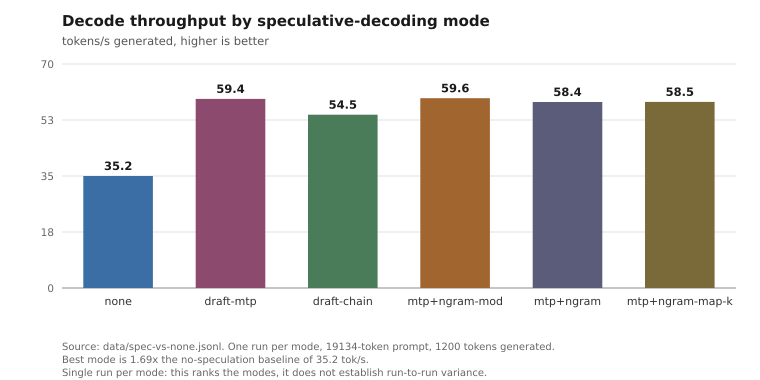

# Speculative decoding on a dense 27B model

Speculative decoding doubled generation throughput here. There is a widely
cited negative result showing it giving nothing on a similar-sized model, and
both results are correct. The difference is dense versus mixture-of-experts.

## Result

Measured over a 30-minute soak, same prompt, 1200 tokens generated per request,
272 W / -75 mV / 2200 MHz, 128K context:

| | mean tok/s | runs | range |
|---|---:|---:|---|
| no speculation | 23.82 | 6 | 23.8 - 23.8 |
| `draft-mtp,ngram-map-k` | 47.59 | 11 | 46.6 - 48.6 |

Ratio 2.00x. Source: `data/soak-efficient-nospec-runs.jsonl` and
`data/soak-efficient-ngram-runs.jsonl`.


At factory power settings with a shorter prompt the same comparison gave
35.2 to 59.4 tok/s (1.69x), one run per mode:



Source: `data/spec-vs-none.jsonl`. The mode ranking is the useful part of that
chart; with one run per mode the gaps between the top four modes are not
separable.

## Why it works here and not on a MoE model

The card has roughly 960 GB/s of memory bandwidth. The model is 17.5 GB and it
is dense, so generating one token requires reading every byte of it:

```
960 GB/s / 17.5 GB = about 55 weight passes per second
```

That is the ceiling, and it does not move. Speculative decoding does not make a
pass faster; it commits more than one token per pass, so the observed 2.00x is
consistent with averaging about two committed tokens per weight read. The
measurement is the throughput ratio; the per-pass figure is an inference from
it, not something the harness counts directly. Draft acceptance is recorded per
request as `accept_pct` if you want the related number the harness does
measure.

On a mixture-of-experts model with, say, 3B active parameters, each token
already reads a small fraction of the weights, so generation is far less
bandwidth-bound and there is much less headroom for this trick to recover. A
published null result on such a model is not in conflict with this one. The
axis that separates them is dense versus MoE, not the GPU.

If you are deciding whether to try this, start from how bandwidth-bound your
setup is. The more bound it is, the more speculation has to offer.

## Parameters

```
--spec-type draft-mtp,ngram-map-k
--spec-draft-n-max 3
--spec-draft-p-min 0.60
--cache-type-k-draft q8_0 --cache-type-v-draft turbo4
```

`n-max` above 3 was slower and used more VRAM at every value tried (4, 5, 6).

`ngram-map-k` is fork-only. `draft-mtp` is upstream.

## The n-gram component only pays off across turns

`ngram-map-k` was neutral on a single request (`data/single-shot.jsonl`) and cut
about 21 percent off the wall clock of a ten-turn session. The session figure is
the `session_s` field of the summary record in `data/multiturn-session.jsonl`,
compared between the variant with `ngram-map-k` and the one without, over the
same replayed transcript (`prompts/turns.json`); `scripts/analyze_multiturn.py`
does the comparison. It costs a few tens of MiB of host RAM and no measurable
VRAM at 128K.

This is worth stating plainly because it has a methodological consequence: a
benchmark that issues one request cannot detect this setting at all. It will
report "no difference" correctly and mislead anyone deciding whether to enable
it for interactive use. If you benchmark speculation, replay a session.
